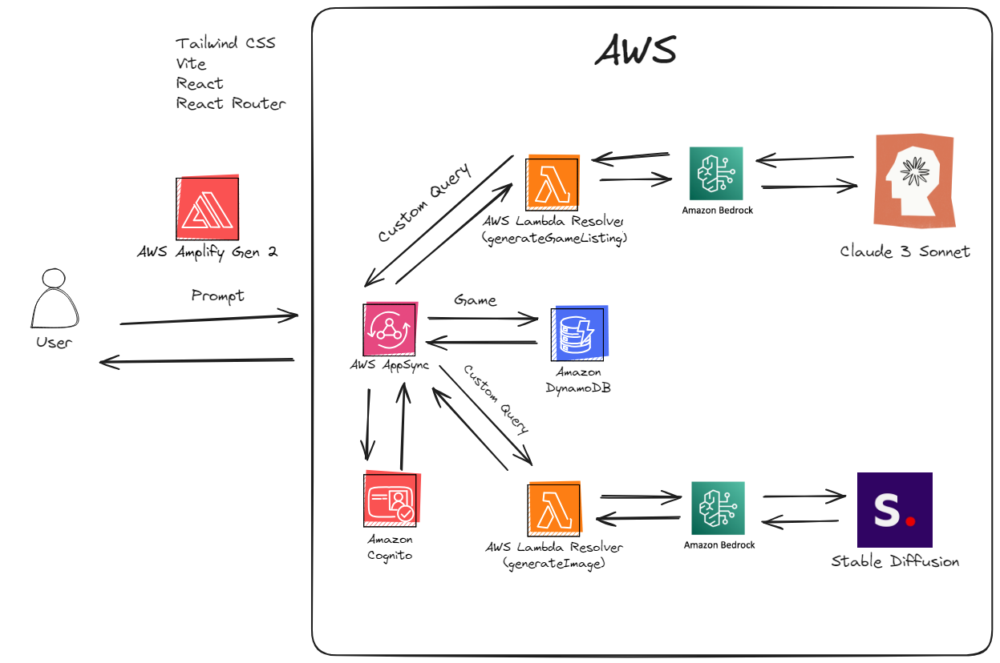

# Create a Generative AI Game Store Catalog Creator

This is an example app that shows how to use [AWS Amplify Gen 2](https://docs.amplify/aws) to create a game catalog creator. It will use Claude 3 and Stable Diffusion to generate text and images and then save the data into AWS AppSync.

This diagrams explains the services used.



## Getting Started

### Clone repo

```

git clone https://github.com/aws-samples/game-bedrock-app.git
cd game-bedrock-app

```

### Install the packages

```

npm i

```

### Initiate a cloud sandbox environment

```

npx ampx sandbox

```

### Run the App

```

npm run dev

```

> > > > > > > 95a1277 (Initial commit)

## License

This library is licensed under the MIT-0 License. See the LICENSE file.
